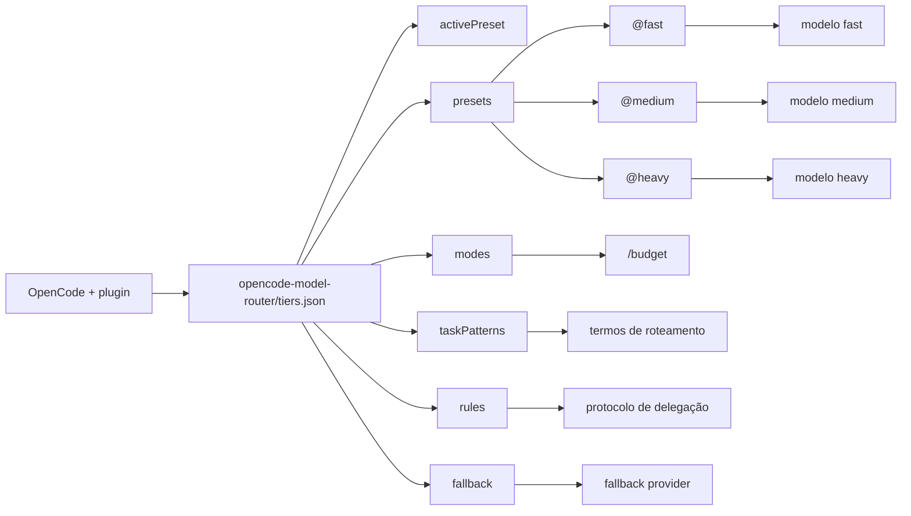

# opencode-model-router

Este diretório centraliza a configuração versionada do plugin `opencode-model-router` para o OpenCode.

A configuração principal está em:

```text
opencode-model-router/tiers.json
```

O pacote npm instalado globalmente aponta para esse arquivo por symlink, porque o plugin npm lê a configuração a partir da raiz do pacote:

```text
~/.nvm/versions/node/v22.22.3/lib/node_modules/opencode-model-router/tiers.json
  -> /home/marcos/Projects/agents-config/opencode-model-router/tiers.json
```

Também deixei o state do router direcionado para o repo:

```text
~/.config/opencode/opencode-model-router.state.json
  -> /home/marcos/Projects/agents-config/opencode-model-router/opencode-model-router.state.json
```

Portanto:

- `opencode-model-router/tiers.json` é a configuração versionada de roteamento.
- `opencode-model-router/opencode-model-router.state.json` é o estado persistente versionado do runtime do router.

## Como funciona

O plugin injeta em cada mensagem uma pequena instrução de roteamento para a agente orquestradora do OpenCode. Ela decide quando executar tarefas diretamente e quando delegar para subagentes de tier:

- `@fast` — exploração, leitura, busca, grep, listagem e consultas simples.
- `@medium` — implementação, refatoração, testes, correções e edições.
- `@heavy` — arquitetura, debug complexo, segurança, performance e análise profunda.

A configuração é composta por:



## Onde ficam as configurações persistentes

O plugin lê a configuração principal em:

```text
opencode-model-router/tiers.json
```

Ele salva o estado persistente em:

```text
~/.config/opencode/opencode-model-router.state.json
```

Neste repo, esse arquivo está direcionado para:

```text
opencode-model-router/opencode-model-router.state.json
```

Esse arquivo guarda, quando existe:

- `activePreset`
- `activeMode`
- `enforcementMode`

Quando existe, ele sobrescreve `activePreset` e `activeMode` definidos em `tiers.json`. Ele **não** altera os modelos usados no roteamento: os modelos continuam em `presets.<preset>.<tier>.model` dentro de `opencode-model-router/tiers.json`.

Use esse state para centralizar a escolha ativa do preset e modo sem misturar com a taxonomia de roteamento ou a lista de modelos.

Comandos úteis:

```text
/preset          lista presets disponíveis
/preset <name>   altera o preset ativo e salva no state
/budget          lista modos disponíveis
/budget <mode>   altera o modo ativo e salva no state
/tiers           mostra os tiers ativos, modelos e regras
```

## Estrutura de `tiers.json`

### Top-level

| Campo | O que controla | Onde alterar |
|---|---|---|
| `activePreset` | preset padrão usado quando não há state salvo | `activePreset` |
| `activeMode` | modo padrão usado quando não há state salvo | `activeMode` |
| `tierCaps` | limite base de chamadas read-only por subagent | `tierCaps` |
| `tierPrompts` | prompts globais dos subagents | `tierPrompts` |
| `presets` | modelos por provedor e tier | `presets.<preset>.<tier>` |
| `taskPatterns` | palavras-chave que disparam `@fast`, `@medium` ou `@heavy` | `taskPatterns.<tier>` |
| `modes` | perfis de comportamento com `/budget` | `modes.<mode>` |
| `fallback` | ordem de providers usados quando um provider falha | `fallback.global` ou `fallback.presets` |
| `rules` | regras compactas injetadas no prompt de roteamento | `rules` |
| `defaultTier` | tier padrão quando não há indicação de complexidade | `defaultTier` |

## Presets

Presets mudam os modelos reais usados pelos subagents.

Exemplo:

```json
{
  "activePreset": "anthropic",
  "presets": {
    "anthropic": {
      "fast": {
        "model": "anthropic/claude-haiku-4-5",
        "costRatio": 1,
        "description": "Haiku 4.5 para exploração",
        "steps": 30,
        "whenToUse": ["Codebase exploration", "grep", "read", "ls"]
      },
      "medium": {
        "model": "anthropic/claude-sonnet-4-6",
        "variant": "max",
        "costRatio": 5,
        "description": "Sonnet 4.6 max para implementação",
        "steps": 50,
        "whenToUse": ["Feature implementation", "Refactoring", "Tests"]
      },
      "heavy": {
        "model": "anthropic/claude-opus-4-8",
        "variant": "max",
        "costRatio": 20,
        "description": "Opus 4.8 max para arquitetura e debug complexo",
        "steps": 120,
        "whenToUse": ["Architecture", "Security", "Performance", "Complex debugging"]
      }
    }
  }
}
```

No arquivo atual, os presets disponíveis são:

| Preset | `@fast` | `@medium` | `@heavy` |
|---|---|---|---|
| `anthropic` | `anthropic/claude-haiku-4-5` | `anthropic/claude-sonnet-4-6` com `max` | `anthropic/claude-opus-4-8` com `max` |
| `openai` | `openai/gpt-5.4-mini-fast` | `openai/gpt-5.5-fast` com `high` | `openai/gpt-5.5-fast` com `xhigh` |
| `github-copilot` | `github-copilot/claude-haiku-4-5` | `github-copilot/claude-sonnet-4-6` | `github-copilot/claude-opus-4-6` com `thinking` |
| `google` | `google/gemini-2.5-flash` | `google/gemini-2.5-pro` | `google/gemini-3-pro-preview` |
| `hybrid` | `anthropic/claude-haiku-4-5` | `openai/gpt-5.5-fast` com `high` | `anthropic/claude-opus-4-8` com `max` |

Para mudar qual preset fica ativo:

1. Edite `activePreset`, se quiser alterar o valor padrão no arquivo.
2. Execute `/preset <name>` no OpenCode para persistir a escolha.
3. Reinicie o OpenCode ou alterne o preset para invalidar o cache do plugin.

Observação: o modelo principal/orquestrador do OpenCode fica separado, em `opencode/opencode.json`. `tiers.json` define os modelos dos subagents `@fast`, `@medium` e `@heavy`.

## Campos de cada tier

Cada tier dentro de `presets` aceita:

| Campo | Tipo | Obrigatório | Para quê |
|---|---|---:|---|
| `model` | `string` | sim | ID completo do modelo, no formato `provider/modelo` |
| `variant` | `string` | não | Variante usada no protocolo, como `max`, `high`, `xhigh` ou `thinking` |
| `costRatio` | `number` | sim, quando usado | Peso relativo de custo do tier |
| `description` | `string` | sim | Descrição mostrada em `/tiers` |
| `steps` | `number` | não | Limite de voltas/tentativas do subagent |
| `prompt` | `string` | não | Prompt específico para um preset/tier; se ausente, usa `tierPrompts` |
| `whenToUse` | `string[]` | sim | Casos de uso mostrados em `/tiers` |

Para alterar o modelo de um tier:

```json
{
  "presets": {
    "anthropic": {
      "medium": {
        "model": "anthropic/claude-sonnet-4-6",
        "variant": "max",
        "costRatio": 5,
        "description": "Sonnet 4.6 max para implementação, refatoração e testes",
        "steps": 50,
        "whenToUse": ["Feature implementation", "Refactoring", "Writing tests", "Bug fixes"]
      }
    }
  }
}
```

## `taskPatterns`

`taskPatterns` é a taxonomia de termos que orienta o roteamento.

```json
{
  "taskPatterns": {
    "fast": [
      "search",
      "grep",
      "read",
      "git-info",
      "ls",
      "lookup-docs/types",
      "count",
      "exists-check",
      "rename"
    ],
    "medium": [
      "impl-feature",
      "refactor",
      "write-tests",
      "bugfix(≤2)",
      "edit-logic",
      "code-review",
      "build-fix",
      "create-file",
      "db-migrate",
      "api-endpoint",
      "config-update"
    ],
    "heavy": [
      "arch-design",
      "debug(≥3fail)",
      "sec-audit",
      "perf-opt",
      "migrate-strategy",
      "multi-system-integration",
      "tradeoff-analysis",
      "rca"
    ]
  }
}
```

Alterar aqui muda a correspondência textual. Exemplos:

- Adicionar `"investigate"` a `fast` para rotar buscas amplas como exploração.
- Adicionar `"deploy"` a `heavy` se deploy complexo exigir análise arquitetural.
- Remover `"rename"` de `fast` se renomear arquivos exigir um subagent de implementação.

## `tierPrompts` e `prompt`

`tierPrompts` define prompts globais para os subagents.

```json
{
  "tierPrompts": {
    "fast": "Você é @fast — especialista em exploração read-only. Resolva o problema sem editar arquivos.",
    "medium": "Você é @medium — especialista em implementação. Mantenha padrões existentes e rode verificações focadas.",
    "heavy": "Você é @heavy — analista sênior. Não execute exploração ampla; peça escopo quando necessário."
  }
}
```

Se quiser trocar apenas um prompt por provider:

```json
{
  "presets": {
    "google": {
      "fast": {
        "model": "google/gemini-2.5-flash",
        "prompt": "Você é @fast usando Gemini. Foque em buscas curtas e retorno com caminhos e trechos.",
        "costRatio": 1,
        "description": "Gemini 2.5 Flash para exploração rápida",
        "steps": 30,
        "whenToUse": ["Codebase exploration", "Grep", "Read"]
      }
    }
  }
}
```

Ordem de resolução:

1. `presets.<preset>.<tier>.prompt`
2. `tierPrompts.<tier>`
3. prompt padrão do plugin, se nenhum existir

## `rules`

`rules` é uma lista de regras compactas injetadas no prompt de roteamento.

```json
{
  "rules": [
    "[tier:X] tag in plan → delegate to X",
    "plan:fast/cheap→@fast | plan:medium→@medium | plan:heavy→@heavy",
    "default preference: read-only work → @fast; implementation → @medium",
    "orchestrate=self, execute=subagent",
    "trivial (≤1 tool call, no expected follow-up) → direct, skip-delegate",
    "before dispatching @heavy: gather context first (usually via @fast)",
    "if self is opus: skip-@heavy; do it locally",
    "min(cost, adequate-tier)"
  ]
}
```

Use para mudar comportamento de alto nível. Alterações em `rules` mudam a decisão de delegação, mesmo quando os modelos permanecem os mesmos.

## `modes`

`modes` define perfis de roteamento ativados por `/budget <mode>`.

```json
{
  "modes": {
    "normal": {
      "defaultTier": "medium",
      "description": "Balanceado entre qualidade e custo"
    },
    "budget": {
      "defaultTier": "fast",
      "description": "Economia agressiva",
      "overrideRules": [
        "default→@fast",
        "@medium only for multi-file edits, refactors, test suites, or build fixes",
        "@heavy only for user-requested deep work or repeated failures"
      ]
    },
    "quality": {
      "defaultTier": "medium",
      "description": "Qualidade acima do custo",
      "overrideRules": [
        "default→@medium",
        "@heavy for architecture, security, complex debugging, and multi-file coordination",
        "CAP:none on subagent dispatches"
      ]
    },
    "deep": {
      "defaultTier": "heavy",
      "description": "Análise profunda",
      "overrideRules": [
        "@heavy for architecture/debug/security by default",
        "@medium for implementation and multi-file changes",
        "trivial reads remain direct",
        "prefer @fast exploration before @heavy when context is incomplete"
      ]
    }
  }
}
```

Para mudar o modo padrão:

```json
{
  "activeMode": "normal"
}
```

Para mudar o modo ativo no runtime:

```text
/budget budget
/budget quality
/budget deep
```

## `tierCaps`

`tierCaps` controla o limite base de chamadas read-only por subagent:

```json
{
  "tierCaps": {
    "fast": 8,
    "medium": 5,
    "heavy": 3
  }
}
```

Valores maiores permitem mais leituras; valores menores tornam o subagent mais conservador.

O orchestrator também tem limite próprio no prompt: ele deve executar no máximo 2 chamadas read-only diretas por turno e delegar o restante para `@fast`.

## `fallback`

`fallback` define a ordem de providers usados quando um provider falha.

```json
{
  "fallback": {
    "global": {
      "anthropic": ["openai", "google", "github-copilot"],
      "openai": ["anthropic", "google", "github-copilot"],
      "github-copilot": ["anthropic", "openai", "google"],
      "google": ["anthropic", "openai", "github-copilot"]
    }
  }
}
```

Se quiser fallback específico por preset:

```json
{
  "fallback": {
    "presets": {
      "hybrid": {
        "anthropic": ["openai", "google", "github-copilot"],
        "openai": ["anthropic", "google", "github-copilot"]
      }
    }
  }
}
```

## `defaultTier`

`defaultTier` define o tier usado quando não há sinal claro de complexidade.

Atualmente:

```json
{
  "defaultTier": "medium"
}
```

Altere para `fast`, `medium` ou `heavy` se quiser um comportamento padrão diferente.

## Opções avançadas

### Enforcement

O plugin suporta `enforcement` para aplicar camadas de verificação e guardrails em delegações.

```json
{
  "enforcement": {
    "mode": "advisory",
    "perTier": {
      "fast": "advisory",
      "medium": "advisory",
      "heavy": "enforced"
    },
    "verify": {
      "require": "whenDoDPresent",
      "preferDeterministic": true,
      "minGraderTier": "medium"
    },
    "escalate": {
      "floorTier": "medium",
      "ladder": ["medium", "heavy"],
      "maxAttemptsPerTier": 2,
      "maxTotalAttempts": 4,
      "costCeiling": {
        "base": "fast",
        "multiple": 20
      }
    },
    "guard": {
      "blockSelfScript": true,
      "blockScriptWrites": true
    },
    "proportional": {
      "trivialBypass": true
    }
  }
}
```

Modos válidos:

| `enforcement.mode` | Efeito |
|---|---|
| `off` | Comportamento clássico de routing, sem hard-block |
| `advisory` | Aplica guias e banners, mas não bloqueia |
| `enforced` | Ativa hard-block e verificação de delegation |

Também pode forçar por variável de ambiente:

```bash
MODEL_ROUTER_ENFORCE=1
MODEL_ROUTER_ENFORCE=0
```

`1` força `enforced`; `0` força `off`.

### Delegate tool experimental

Ativa uma ferramenta própria do plugin:

```json
{
  "experimental": {
    "verifiedDelegateTool": true
  }
}
```

Ou:

```bash
MODEL_ROUTER_VERIFIED_DELEGATE=1
```

## Como aplicar mudanças

1. Edite `opencode-model-router/tiers.json`.
2. Valide JSON:
   ```bash
   node -e "JSON.parse(require('fs').readFileSync('opencode-model-router/tiers.json','utf8')); console.log('tiers.json OK')"
   ```
3. Reinicie o OpenCode ou alterne com `/preset` e `/budget` para recarregar o cache.
4. Verifique:
   ```text
   /tiers
   /preset
   /budget
   ```

## Exemplo: mudar o modelo de implementação

Quer alterar o `@medium` do preset Anthropic:

```json
{
  "activePreset": "anthropic",
  "presets": {
    "anthropic": {
      "medium": {
        "model": "anthropic/claude-sonnet-4-6",
        "variant": "max",
        "costRatio": 5,
        "description": "Sonnet 4.6 max para implementação, refatoração, testes e code review",
        "steps": 50,
        "whenToUse": [
          "Feature implementation",
          "Refactoring",
          "Writing tests",
          "Code review",
          "Bug fixes"
        ]
      }
    }
  }
}
```

Depois:

```text
/preset anthropic
```

Ou reinicie o OpenCode.

## Regra de ouro

Para mudar o custo de uso, altere principalmente:

1. `presets.<preset>.<tier>.model`
2. `presets.<preset>.<tier>.costRatio`
3. `presets.<preset>.<tier>.steps`
4. `rules`
5. `modes.<mode>.overrideRules`

Para mudar a decisão de roteamento, altere:

1. `taskPatterns.<tier>`
2. `rules`
3. `modes.<mode>.overrideRules`
4. `defaultTier`

Para mudar o comportamento dos subagents, altere:

1. `tierPrompts.<tier>`
2. `presets.<preset>.<tier>.prompt`
3. `tierCaps`
4. `enforcement`
