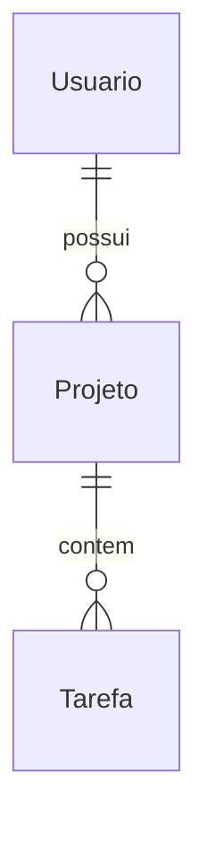

# Documentacao Tecnica — Guia Universal

> Funciona para qualquer tipo de projeto: APIs REST/GraphQL, frontends (React, Vue, Svelte, Angular), apps mobile (React Native, Flutter, Swift, Kotlin), desktop (Electron, Tauri), CLIs, bibliotecas, monorepos.

**Toda documentacao gerada deve estar em portugues brasileiro.**

---

## Principios

- Documente o que **existe no codigo**, nunca suposicoes
- Antes de escrever qualquer coisa, leia os arquivos de codigo relevantes
- Ao atualizar arquivo existente, preserve secoes que nao esta alterando
- Inclua diagramas Mermaid sempre que ajudarem a comunicar fluxos ou relacoes
- Mostre um resumo do que sera criado/modificado **antes de gravar**

---

## Workflow Obrigatorio

### 1. Explorar o codigo-fonte

Leia os arquivos relevantes antes de documentar. Identifique:
- Stack e linguagem
- Estrutura de pastas
- Pontos de entrada (rotas, handlers, main, App)
- Models/schemas/tipos
- Dependencias externas

### 2. Verificar docs existentes

```bash
find docs/ -name "*.md" 2>/dev/null | sort
```

- **Arquivo existe** → atualize apenas secoes afetadas
- **Nao existe** → crie com estrutura completa

### 3. Apresentar plano ao usuario

Antes de gravar, mostre quais arquivos serao criados/modificados.

### 4. Gravar artefatos

Use `edit` para existentes; `write` para novos.

### 5. Relatorio final

Liste todos os arquivos criados/atualizados com caminho completo.

---

## Artefatos Disponiveis

Escolha os que fazem sentido para o projeto. Nem todo projeto precisa de todos.

### ADR (Architecture Decision Record)

**Arquivo:** `docs/adr/NNNN-titulo-kebab-case.md`

Crie um ADR quando uma decisao tecnica significativa for tomada (framework, banco, padrao de autenticacao, estrategia de cache, etc).

Template MADR compacto:

```markdown
# NNNN — Titulo da Decisao

## Status

aceito | proposto | depreciado | substituido por [NNNN]

## Contexto

O problema ou forca que motivou a decisao.

## Decisao

A escolha feita: "Decidimos usar X porque Y."

## Consequencias

- (+) Pontos positivos
- (-) Trade-offs e pontos negativos
```

Regras:
- Numeros sequenciais: `0001`, `0002`, ...
- Seja especifico: nome exato da lib/versao/protocolo
- Diga o **porque**, nao apenas o **que**

---

### Tabela de Endpoints / Rotas de API

**Arquivo:** `docs/api.md`

```markdown
| Metodo | Caminho | Autenticacao | Corpo | Resposta | Erros |
|---|---|---|---|---|---|
| `GET` | `/recursos` | JWT | — | `200` lista | `401` |
| `POST` | `/recursos` | JWT | `CriarSchema` | `201` criado | `400`, `422` |
```

---

### Tabela de Models / Schemas

**Arquivo:** `docs/models.md`

```markdown
## Model: `Usuario`

**Arquivo:** `src/models/usuario.py` (ou .ts, .go, .dart, etc)

| Campo | Tipo | Obrigatorio | Descricao |
|---|---|---|---|
| `id` | UUID | Sim (PK) | Identificador unico |
| `email` | string | Sim (unique) | Email do usuario |
| `criado_em` | datetime | Sim | Data de criacao |
```

Para ER diagrams, use Mermaid inline:

```markdown

```

---

### Tabela de Componentes / Modulos

**Arquivo:** `docs/components.md`

Serve para componentes React, widgets Flutter, views SwiftUI, modulos Go, classes Java — qualquer unidade reutilizavel.

```markdown
## Componente: `NomeDoComponente`

**Arquivo:** `src/components/NomeDoComponente.tsx`
**Descricao:** O que faz.

### Props / Parametros

| Prop | Tipo | Obrigatorio | Padrao | Descricao |
|---|---|---|---|---|
| `titulo` | `string` | Sim | — | Texto do cabecalho |

### Dependencias

| Dependencia | Tipo | Motivo |
|---|---|---|
| `useAuth` | Hook | Verifica autenticacao |
```

---

### Tabela de Rotas / Navegacao

**Arquivo:** `docs/routes.md`

```markdown
| Caminho / Tela | Componente / Handler | Autenticacao | Descricao |
|---|---|---|---|
| `/` | `HomePage` | Nao | Pagina inicial |
| `/dashboard` | `DashboardPage` | Obrigatoria | Painel principal |
```

---

### Tabela de Estado Global

**Arquivo:** `docs/state.md`

```markdown
| Chave | Tipo | Valor inicial | Quem atualiza | Descricao |
|---|---|---|---|---|
| `usuario` | `User \| null` | `null` | login/logout | Usuario autenticado |
```

---

### Inventario de Servicos

**Arquivo:** `docs/architecture.md`

```markdown
| Servico | Responsabilidade | Tecnologia | Porta | Dependencias |
|---|---|---|---|---|
| API | Logica de negocio | FastAPI | 8000 | PostgreSQL |
| Frontend | Interface | React + Vite | 5173 | API |
```

---

## Diagramas Mermaid

Prefira Mermaid inline nos arquivos `.md`. Nunca use `\n` literal — use `<br/>` para quebra de linha em labels.

| Situacao | Tipo |
|---|---|
| Fluxo de requisicao, pipeline | `flowchart LR` ou `flowchart TD` |
| Sequencia de chamadas | `sequenceDiagram` |
| Relacionamentos entre entidades | `erDiagram` |
| Estados de um objeto | `stateDiagram-v2` |
| Dependencias entre modulos | `graph TD` |

---

## Diagramas Excalidraw

Para diagramas mais elaborados (C4, ER detalhado, fluxos complexos), use a skill `excalidraw`.
Salve em `docs/diagrams/`.

---

## Regras de Qualidade

- Nunca documente sem ler o codigo
- Nunca invente campos que nao existem
- Diagramas Mermaid sao parte da documentacao, nao opcional
- Use a linguagem/stack real do projeto nos exemplos
- Adapte os templates ao que faz sentido — nao force artefatos irrelevantes
