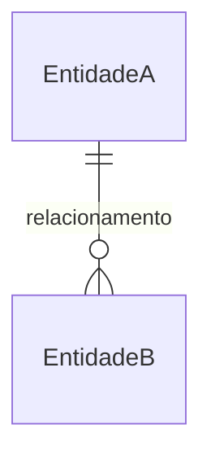

# Documentacao Tecnica — Guia Universal

> Funciona para qualquer tipo de projeto: APIs REST/GraphQL, frontends (React, Vue, Svelte, Angular), apps mobile (React Native, Flutter, Swift, Kotlin), desktop (Electron, Tauri), CLIs, bibliotecas, monorepos.

**Toda documentacao gerada deve estar em portugues brasileiro.**

---

## Instrucoes para o Agente

### Principios

- Documente o que **existe no codigo**, nunca suposicoes
- Antes de escrever qualquer coisa, leia os arquivos de codigo relevantes
- Ao atualizar arquivo existente, preserve secoes que nao esta alterando
- Inclua diagramas Mermaid sempre que ajudarem a comunicar fluxos ou relacoes
- Mostre um resumo do que sera criado/modificado **antes de gravar**

### Workflow Obrigatorio

1. **Explorar** — leia codigo-fonte: stack, estrutura, pontos de entrada, models, dependencias
2. **Verificar docs existentes** — liste arquivos `.md` em `docs/`. Se existir, atualize apenas secoes afetadas; se nao, crie do zero
3. **Apresentar plano** — mostre ao usuario quais arquivos serao criados/modificados
4. **Gravar** — `edit_file` para existentes, `write_file` para novos
5. **Relatar** — liste arquivos criados/atualizados com caminho completo

### Regras de Qualidade

- Nunca documente sem ler o codigo
- Nunca invente campos que nao existem no codigo real
- Inclua diagramas Mermaid sempre que relevante. Prefira Mermaid inline. Nunca use `\n` literal — use `<br/>` para quebra de linha em labels
- Use a linguagem/stack real do projeto nos valores preenchidos
- Adapte os templates ao projeto — nao force artefatos irrelevantes

---

## Templates de Documentacao

Escolha os que fazem sentido para o projeto. Cada template abaixo é o formato a ser gerado; preencha com dados reais do codigo.

Significado das colunas em tabelas:

- **Obrigatorio**: `Sim` (obrigatorio) / `Nao` (opcional) — use `PK` se for chave primaria, `unique` se unico
- **Autenticacao**: descreva o esquema real usado (JWT, OAuth2, API Key, Basic, session, etc.)
- **Tipo**: use o tipo da linguagem do projeto (`string`, `int`, `UUID`, `User`, `DateTime`, etc.)

---

### ADR — `docs/adr/NNNN-titulo-kebab-case.md`

Crie quando uma decisao tecnica significativa for tomada (framework, banco, autenticacao, cache, etc.).

```markdown
# NNNN — Titulo da Decisao

## Status

aceito | proposto | depreciado | substituido por [NNNN]

## Contexto

O problema ou forca que motivou a decisao.

## Decisao

A escolha feita: "Decidimos usar X porque Y."

## Consequencias

- (+) Pontos positivos
- (-) Trade-offs e pontos negativos
```

Numeros sequenciais: `0001`, `0002`, ... Seja especifico (lib/versao) e diga o **porque**.

---

### Endpoints / Rotas de API — `docs/api.md`

| Metodo | Caminho / Operacao | Autenticacao | Corpo / Variaveis | Resposta | Erros |
|---|---|---|---|---|---|
| `GET` | `/recursos` | `AuthScheme` | — | `200` lista | `401` |
| `POST` | `/recursos` | `AuthScheme` | `Schema` | `201` criado | `400`, `422` |
| `PUT` | `/recursos/{id}` | `AuthScheme` | `Schema` | `200` atualizado | `404`, `422` |
| `DELETE` | `/recursos/{id}` | `AuthScheme` | — | `204` sem corpo | `404` |

Ajuste as colunas para o protocolo do projeto (REST, GraphQL, gRPC).

---

### Models / Schemas / Entidades — `docs/models.md`

Cada entidade segue o formato:

```markdown
## Model: `NomeDaEntidade`

**Arquivo:** `caminho/para/o/arquivo`
**Descricao:** O que esta entidade representa.

| Campo | Tipo | Obrigatorio | Descricao |
|---|---|---|---|
| `id` | `tipo` | Sim (PK) | Identificador unico |
| ... | ... | ... | ... |
```

Para diagramas ER, use Mermaid inline:



---

### Componentes / Modulos / Unidades — `docs/components.md`

> Serve para qualquer unidade reutilizavel: componentes React, widgets Flutter, modulos Go, classes Java, funcoes Python, comandos CLI, Activities Android, etc.

Cada componente segue o formato:

```markdown
## Componente/Modulo: `Nome`

**Arquivo:** `caminho/para/o/arquivo`
**Categoria:** (componente | modulo | classe | funcao | comando | widget | ...)
**Descricao:** O que faz.

### Interface / Parametros

| Nome | Tipo | Obrigatorio | Padrao | Descricao |
|---|---|---|---|---|
| `param` | `tipo` | Sim/Nao | valor | Descricao |

### Dependencias

| Dependencia | Relacao | Motivo |
|---|---|---|
| `nome` | (importa | herda | injeta | chama) | Descricao |
```

---

### Rotas / Navegacao — `docs/routes.md`

| Caminho / Tela | Componente / Handler | Autenticacao | Descricao |
|---|---|---|---|
| `/` | `Componente` | Nao/Obrigatoria | Pagina inicial |
| `/exemplo` | `Componente` | Obrigatoria | Descricao da tela |

---

### Estado Global — `docs/state.md`

| Chave / Escopo | Tipo | Valor inicial | Quem atualiza | Descricao |
|---|---|---|---|---|
| `chave` | `Tipo` | valor | acao/evento | Descricao |

---

### Arquitetura / Servicos — `docs/architecture.md`

| Servico / Modulo | Responsabilidade | Tecnologia | Porta / URL | Dependencias |
|---|---|---|---|---|
| `nome` | Descricao | linguagem/framework | porta/endpoint | servicos dependentes |

---

### Eventos / Mensagens — `docs/events.md`

Crie quando o projeto usar filas, pub/sub, webhooks, ou comunicacao assincrona.

| Evento / Mensagem | Publisher | Consumer | Payload | Tipo |
|---|---|---|---|---|
| `nome.do.evento` | modulo/servico | modulo/servico | `{ campo }` | async/sync |

---

### Configuracoes — `docs/config.md`

| Variavel | Descricao | Tipo | Padrao | Obrigatorio | Onde se usa |
|---|---|---|---|---|---|
| `NOME_DA_VAR` | Descricao | string/int/bool | valor | Sim/Nao | modulo/servico |

---

### Seguranca — `docs/security.md`

## Autenticacao

| Esquema | Detalhes | Endpoints protegidos |
|---|---|---|
| `Tipo` | Descricao do fluxo | Quais endpoints |

## Autorizacao / Papeis

| Papel | Permissoes | Quem possui |
|---|---|---|
| `admin` | descricao | time interno |

## Protecoes adicionais

| Protecao | Descricao |
|---|---|
| Rate limiting | Limite de requisicoes |
| CORS | Origens permitidas |

---

### Erros — `docs/errors.md`

## Codigos de erro da aplicacao

| Codigo | Mensagem | Causa | Resolucao |
|---|---|---|---|
| `ERR_001` | Mensagem | O que causa | Como resolver |

## Codigos HTTP (se aplicavel)

| Status | Significado | Quando ocorre |
|---|---|---|
| `400` | Bad Request | Dados invalidos |
| `401` | Unauthorized | Token ausente/invalido |
| `403` | Forbidden | Sem permissao |
| `404` | Not Found | Recurso nao encontrado |
| `422` | Unprocessable Entity | Validacao falhou |
| `429` | Too Many Requests | Rate limit excedido |
| `500` | Internal Server Error | Erro inesperado |

---

### Indice da Documentacao — `docs/index.md`

Ponto de entrada. Atualize ao adicionar/remover artefatos.

| Documento | Descricao |
|---|---|
| [API](api.md) | Endpoints, metodos, autenticacao |
| [Models](models.md) | Entidades, schemas, campos |
| [Componentes](components.md) | Componentes, modulos |
| ... | ... |

Inclua apenas secoes que existem no projeto.

---

### README.md (raiz do projeto)

```markdown
# `NomeDoProjeto`

> Descricao curta do projeto (1-2 linhas).

## Stack

- **Backend:** linguagem / framework
- **Frontend:** linguagem / framework
- **Banco:** nome do banco
- **Infra:** cloud / docker / etc

## Pre-requisitos

- Linguagem versao X
- Gerenciador de pacotes Y

## Instalacao

```bash
# comandos para instalar e rodar
```

## Documentacao

Veja [docs/index.md](docs/index.md) para documentacao detalhada.

## Comandos uteis

| Comando | Descricao |
|---|---|
| `make dev` | Sobe ambiente de desenvolvimento |
| `make test` | Roda testes |
```
